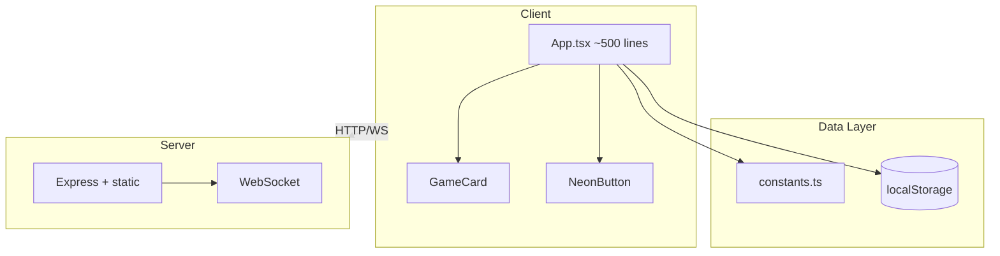
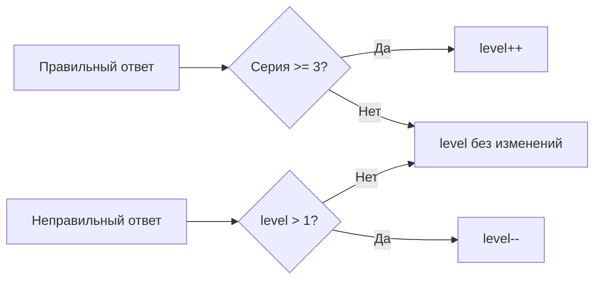

# MathDash: Production Ready Plan

## 1. Анализ проекта и узкие места

### Текущая архитектура




### Критические узкие места


| Проблема                   | Файл                                                              | Описание                                                                                                  |
| -------------------------- | ----------------------------------------------------------------- | --------------------------------------------------------------------------------------------------------- |
| **Таймер не работает**     | [App.tsx](App.tsx)                                                | `timeLeft`, `timerRef` задаются, но нет `useEffect` для обратного отсчёта — игрок может сидеть бесконечно |
| **globalTimeLeft в Blitz** | [App.tsx](App.tsx)                                                | Нет отображения и логики окончания игры при 0                                                             |
| **Gemini не вызывается**   | [App.tsx](App.tsx), [geminiService.ts](services/geminiService.ts) | `getMathFact`, `getEncouragement` импортированы, но нигде не вызываются; `mathFact` всегда пустой         |
| **API key в клиенте**      | [geminiService.ts](services/geminiService.ts)                     | `process.env.GEMINI_API_KEY` в бандле — ключ утечёт в браузер                                             |
| **Монолит**                | [App.tsx](App.tsx)                                                | ~500 строк, 25+ `useState`, сложно поддерживать                                                           |
| **Жёсткий PORT**           | [server.ts](server.ts)                                            | `PORT = 3000` — Railway требует `process.env.PORT`                                                        |
| **Нет PWA**                | —                                                                 | Нет manifest, service worker, иконок                                                                      |
| **История только local**   | [App.tsx](App.tsx)                                                | 50 записей в localStorage, без синка с сервером                                                           |


### Уже есть

- Уровни и усложнение по `stats.level` (каждые 5 правильных → `nextLevel++`)
- История решённых задач в `SolvedProblem` с `question`, `answer`, `userAnswer`, `isCorrect`, `timestamp`
- Базовые мобильные стили (`-webkit-tap-highlight-color`, `user-select`, `bg-grid` на 30px)

---

## 2. Подготовка к продакшену

### 2.1 Environment

Создать `.env.example` и `.env` (в `.gitignore`):

```env
# Server
PORT=3000
NODE_ENV=development

# Gemini (server-side only)
GEMINI_API_KEY=

# Supabase
VITE_SUPABASE_URL=
VITE_SUPABASE_ANON_KEY=
```

- `GEMINI_API_KEY` — только на сервере (прокси для math fact). **Опционально** — см. раздел 2.2.
- `VITE_SUPABASE_*` — префикс `VITE_` для доступа в клиенте через `import.meta.env`.

### 2.2 Gemini опционален — интеллект без AI (без трат токенов)

Система должна полноценно работать **без Gemini**. Все «умные» фичи реализуются правилами и данными, без вызовов AI:


| Фича                        | С AI (Gemini)                         | Без AI (fallback)                                            |
| --------------------------- | ------------------------------------- | ------------------------------------------------------------ |
| Math fact при GameOver      | `GET /api/math-fact?level=N` → Gemini | Предопределённый список `MATH_FACTS[level]` в `constants.ts` |
| Encouragement при combo     | Gemini                                | Список `ENCOURAGEMENTS` по combo/level                       |
| Усложнение вопросов         | —                                     | Адаптивный level up/down по серии ответов                    |
| Слабые места                | —                                     | Агрегация ошибок по operation/pattern                        |
| Подбор задач из слабых мест | —                                     | 30% шанс выбрать тип из weak spots                           |


**Реализация:**

1. **API `/api/math-fact`**: если `GEMINI_API_KEY` задан — вызывать Gemini; иначе возвращать `MATH_FACTS[level % MATH_FACTS.length]`.
2. **constants.ts**: добавить `MATH_FACTS: string[]` и `ENCOURAGEMENTS: string[]` — 15–20 фактов и 10–15 фраз.
3. Клиент не знает, откуда пришёл факт — один и тот же интерфейс.

Таким образом приложение работает без токенов и без API-ключей, а Gemini — опциональное улучшение.

### 2.3 Railway

- Использовать `process.env.PORT` в [server.ts](server.ts).
- Build: `npm run build`.
- Start: `node server.js` или `tsx server.ts` (если оставляем TS).
- Добавить `railway.json` или `nixpacks.toml` при необходимости.
- Переменные в Railway: `PORT`, `GEMINI_API_KEY`, `SUPABASE_URL`, `SUPABASE_SERVICE_ROLE_KEY` (если нужен серверный доступ).

### 2.4 Supabase

Схема для истории, слабых мест и лидерборда:

```sql
-- profiles (опционально, если будет auth)
-- sessions (опционально)

-- solved_problems: полная история
CREATE TABLE solved_problems (
  id UUID PRIMARY KEY DEFAULT gen_random_uuid(),
  session_id TEXT,           -- анонимная сессия или user_id
  player_name TEXT,
  age_bracket INT,
  game_mode TEXT,
  question TEXT,
  answer INT,
  user_answer INT,
  is_correct BOOLEAN,
  difficulty INT,
  operation TEXT,            -- '+', '-', '*'
  response_time_ms INT,      -- время ответа (если добавим)
  created_at TIMESTAMPTZ DEFAULT now()
);

-- weak_spots: агрегация ошибок по типам
CREATE TABLE weak_spots (
  id UUID PRIMARY KEY DEFAULT gen_random_uuid(),
  session_id TEXT,
  player_name TEXT,
  operation TEXT,
  pattern TEXT,              -- e.g. "multiplication", "subtraction_below_10"
  error_count INT DEFAULT 0,
  last_wrong_at TIMESTAMPTZ,
  created_at TIMESTAMPTZ DEFAULT now(),
  UNIQUE(session_id, operation, pattern)
);

-- leaderboard
CREATE TABLE leaderboard (
  id UUID PRIMARY KEY DEFAULT gen_random_uuid(),
  player_name TEXT,
  score INT,
  level INT,
  game_mode TEXT,
  created_at TIMESTAMPTZ DEFAULT now()
);
```

Клиент: `@supabase/supabase-js`, вызовы через `lib/data.ts`.

### 2.5 PWA

- `vite-plugin-pwa` + manifest.
- Иконки 192x192, 512x512.
- `index.html`: meta `theme-color`, `apple-mobile-web-app-capable`.
- Стратегия: `generateSW` для статики.

### 2.6 Mobile + Web

- Viewport, touch targets (min 44px).
- `safe-area-inset` для notch.
- Адаптивная сетка (уже есть `md:` breakpoints).
- Отдельные стили для очень маленьких экранов.

---

## 3. Система усложнения вопросов

### Текущая логика

- Уровень растёт каждые 5 правильных ответов.
- Сложность не снижается при ошибках.

### Новая логика (адаптивная)




- **Повышение**: серия из 3+ правильных → `level++` (вместо фиксированных 5).
- **Понижение**: ошибка → `level = Math.max(1, level - 1)`.
- **Порог для усложнения**: константа `CORRECT_STREAK_FOR_LEVEL_UP = 3` в [constants.ts](constants.ts).

---

## 4. Отслеживание слабых мест

### Модель данных

Расширить `SolvedProblem` и добавить агрегацию:

```ts
// types.ts
export interface WeakSpot {
  operation: '+' | '-' | '*';
  pattern: string;      // "basic", "missing_number", "large_numbers"
  errorCount: number;
  lastSeen: number;
}
```

### Извлечение паттерна из задачи

- По `question`: определить `operation` и `pattern` (например, `?` → `missing_number`, большие числа → `large_numbers`).
- При каждой ошибке: `weakSpots[operation][pattern]++`.

### Хранение

- В памяти: `Map<operation_pattern, WeakSpot>`.
- В Supabase: таблица `weak_spots` (агрегация по сессии/игроку).

### Использование в генерации

- В `generateProblem()`: с вероятностью ~30% выбирать задачу из слабых мест (больше шанс на повторение проблемных типов).

---

## 5. История

### Текущее состояние

- 50 записей в localStorage.
- Экран History показывает список.

### План

1. **lib/data.ts** — единый слой данных:
  - `saveSolvedProblem(problem)`
  - `getHistory(limit, offset)`
  - `getWeakSpots()`
  - Реализация: сначала localStorage, потом Supabase.
2. **Supabase** — таблица `solved_problems` (см. выше).
3. **Синхронизация**:
  - При наличии сети — писать в Supabase.
  - При офлайне — в localStorage, затем синк при появлении сети (опционально).
4. **UI History**:
  - Пагинация или бесконечный скролл.
  - Фильтры: по режиму, по дате, только ошибки.
  - Блок «Слабые места» с рекомендациями.

---

## 6. Порядок реализации

### Фаза 1: Продакшен-база

1. Исправить таймер в [App.tsx](App.tsx) (обратный отсчёт `timeLeft`).
2. Добавить отображение и логику окончания Blitz по `globalTimeLeft`.
3. В [server.ts](server.ts) использовать `process.env.PORT`.
4. Создать `.env.example` и обновить `.gitignore`.

### Фаза 2: Деплой

1. Добавить `vite-plugin-pwa`, manifest, иконки.
2. Настроить Railway (build/start, переменные).
3. Создать проект Supabase, таблицы, настроить RLS.

### Фаза 3: Data layer

1. Создать `lib/data.ts` с интерфейсами.
2. Подключить Supabase для истории и лидерборда.
3. Перенести чтение/запись истории и лидерборда в `lib/data.ts`.

### Фаза 4: Усложнение и слабые места

1. Реализовать адаптивную логику level up/down.
2. Добавить извлечение `operation` и `pattern` из задачи.
3. Реализовать `WeakSpot` и сохранение в Supabase.
4. Подмешивать слабые места в `generateProblem()`.

### Фаза 5: История и UI

1. Расширить экран History (фильтры, пагинация).
2. Добавить блок «Слабые места» на главном экране или в History.
3. Вынести math-fact на сервер (API `/api/math-fact`): при наличии `GEMINI_API_KEY` — Gemini, иначе — fallback из `MATH_FACTS` в constants.

---

## 7. Файлы для изменения/создания


| Действие | Файл                                                         |
| -------- | ------------------------------------------------------------ |
| Создать  | `.env.example`                                               |
| Создать  | `lib/data.ts`                                                |
| Создать  | `lib/supabase.ts`                                            |
| Создать  | `public/manifest.json`, иконки                               |
| Изменить | `server.ts` — PORT, API для math-fact                        |
| Изменить | `App.tsx` — таймеры, data layer, усложнение, weak spots      |
| Изменить | `vite.config.ts` — PWA plugin                                |
| Изменить | `index.html` — PWA meta                                      |
| Изменить | `constants.ts` — логика level up, MATH_FACTS, ENCOURAGEMENTS |
| Изменить | `types.ts` — WeakSpot, расширение SolvedProblem              |
| Изменить | `package.json` — vite-plugin-pwa, @supabase/supabase-js      |


---

## 8. Диаграмма целевой архитектуры

```mermaid
flowchart TB
    subgraph client [Client]
        App[App.tsx]
        dataLayer[lib/data.ts]
        App --> dataLayer
    end
    
    subgraph server [Server]
        Express[Express]
        WS[WebSocket]
        MathFactAPI[/api/math-fact]
        Express --> WS
        Express --> MathFactAPI
    end
    
    subgraph external [External]
        Supabase[(Supabase)]
        Gemini[Gemini API optional]
        Constants[MATH_FACTS fallback]
    end
    
    dataLayer -->|REST| Supabase
    client -->|WS| server
    client -->|HTTP| server
    MathFactAPI -->|if key set| Gemini
    MathFactAPI -->|else| Constants
```


